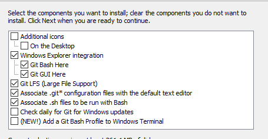
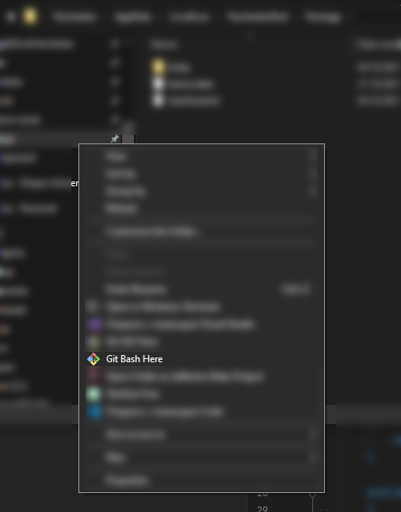
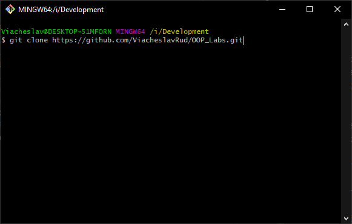

# OOP_Labs

## Install
### Windows
https://git-scm.com/download/win  
Pick Windows explorer integration

## Linux
Usually it's available in your package manger  
https://git-scm.com/download/linux

## Clone the repo

- Open folder in terminal  
For windows:

- type `git clone https://github.com/ViacheslavRud/OOP_Labs.git`

- Open OOP_Labs.sln with your IDE (Visual Studio or Rider)